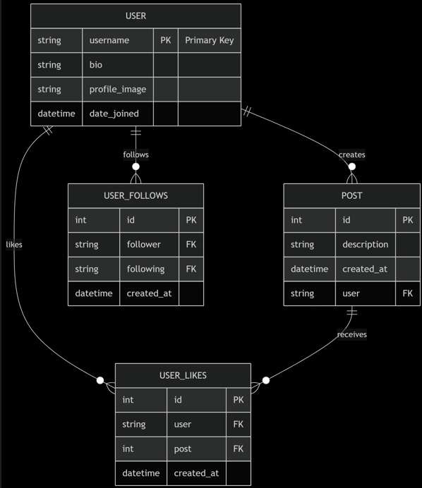

# 🚀 Moments - Social Media Backend  🚀

## 📌 Project Description
**Moments Backend** is the powerhouse behind your social media experience! Built with Django and Django REST Framework, it handles user authentication, post management, and real-time social interactions. Think of it as the "brain" that makes liking, following, and sharing possible!

----
## 🛠️ Tech Stack

- **Django**: Web framework
- **Django REST Framework**: API toolkit
- **Simple JWT**: JWT authentication
- **PostgreSQL**: Database
- **Docker**: Containerization

---

## 🔗 Frontend Repository
👉 **[Moments Frontend](https://git.generalassemb.ly/maysahabbash92/social-media-frontend.git)** 👈  
*(Connect to the shiny React frontend here!)*

---

## 🛣️ API Routing Table

| Endpoint | Method | Description | Requires Auth |
|----------|--------|-------------|---------------|
| `/api/user_data/<str:pk>/` | GET | Get user profile data | ✅ |
| `/api/token/` | POST | Get JWT access/refresh tokens | ❌ |
| `/api/token/refresh/` | POST | Refresh access token | ❌ |
| `/api/register/` | POST | Register new user | ❌ |
| `/api/authenticated/` | GET | Check authentication status | ✅ |
| `/api/toggle_follow/` | POST | Follow/unfollow user | ✅ |
| `/api/posts/<str:pk>/` | GET | Get user's posts | ✅ |
| `/api/toggleLike/` | POST | Like/unlike post | ✅ |
| `/api/create_post/` | POST | Create new post | ✅ |
| `/api/get_posts/` | GET | Get all posts (paginated) | ✅ |
| `/api/search/` | GET | Search users | ✅ |
| `/api/update_user/` | PATCH | Update profile | ✅ |
| `/api/logout/` | POST | Logout (invalidate tokens) | ✅ |

## 📊 ERD Diagram

---

## 🚀 Future Features (Icebox)
- 📹 Stories: 24-hour ephemeral posts
- 💬 Comments: Discuss posts with friends
- 🔔 Notifications: Real-time activity alerts
- 🌓 Dark Mode: Eye-friendly 

## 📚 References 

### 🔐 Authentication
- [JWT Official RFC](https://datatracker.ietf.org/doc/html/rfc7519)
- [Django REST Framework JWT](https://django-rest-framework-simplejwt.readthedocs.io/)
- [Secure JWT Best Practices](https://auth0.com/blog/a-look-at-the-latest-draft-for-jwt-bcp/)

### 🐍 Django & DRF
- [DRF Documentation](https://www.django-rest-framework.org/)
- [Django ORM Optimization](https://docs.djangoproject.com/en/stable/topics/db/optimization/)
- [DRF Serializers Deep Dive](https://www.django-rest-framework.org/api-guide/serializers/)

